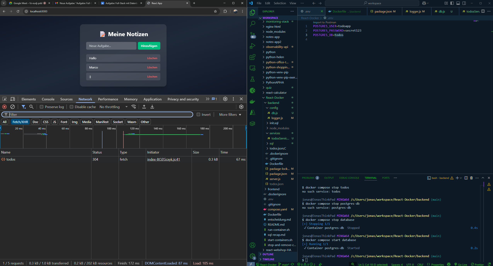

# 🧩 Fullstack Todo-App mit Docker Compose

Dieses Projekt ist eine einfache Fullstack-Webanwendung zur Verwaltung von Todos. Sie besteht aus:

- einem React-Frontend (Vite + Tailwind, ausgeliefert über Nginx)
- einem Express-Backend (Node.js mit PostgreSQL-Anbindung)
- einer PostgreSQL-Datenbank

Alle Services laufen in Docker-Containern und werden mit Docker Compose orchestriert.

## 🚀 Schnellstart

### 1. `.env`-Datei anlegen

Erstelle im Projekt-Root eine `.env`-Datei mit folgendem Inhalt:

```env
POSTGRES_USER=**
POSTGRES_PASSWORD=**
POSTGRES_DB=**
```

## 🚀 Stack starten

docker-compose up --build -d

## 🧱 Schema in der Datenbank initialisieren

docker cp backend/sql/initial_schema.sql postgres-db:/tmp/initial_schema.sql
MSYS_NO_PATHCONV=1 docker exec -u postgres postgres-db psql -U todoapp -d todos -f /tmp/initial_schema.sql

## 🌐 Anwendung im Browser öffnen

http://localhost:8080

## 📁 Verzeichnisstruktur

- `frontend/` – React-Frontend mit Vite + Tailwind, Build via Dockerfile  
- `backend/` – Express-API mit PostgreSQL-Anbindung via `pg`  
- `backend/sql/initial_schema.sql` – SQL-Datei zum manuellen Schema-Import  
- `.env` – Umgebungsvariablen für Datenbankzugang  
- `docker-compose.yml` – Orchestrierung aller Services  

## 🔌 API-Endpunkte

| Methode | Route            | Beschreibung                |
|---------|------------------|-----------------------------|
| GET     | /api/todos       | Alle Todos abrufen          |
| GET     | /api/todos/:id   | Todo nach ID abrufen        |
| POST    | /api/todos       | Neues Todo erstellen        |
| DELETE  | /api/todos/:id   | Todo löschen                |

## 🧠 Technologien

- Docker & Docker Compose  
- Node.js & Express  
- PostgreSQL  
- React (Vite)  
- Tailwind CSS  
- Winston (für Logging)  
- pg (Node PostgreSQL Client)  

## 🛠️ Features

- Nginx als Reverse Proxy für API-Routen  
- ENV-Verwaltung mit `.env` und Docker Compose  
- persistente Volumes für DB und Backend-Dateien  
- SQL-Abfragen mit Parametrisierung zum Schutz vor SQL-Injection  
- saubere Projektstruktur mit Service-/Controller-Pattern  
- Logging von Datenbankkonfiguration (Passwort zensiert)  

## 🧹 Bereinigen

```bash
docker-compose down -v
```
### 🧠 Teamprozess zur Sicherstellung der Stack-Stabilität

Unser Team hat zu Beginn gemeinsam den Aufbau des Full-Stack-Projekts besprochen und klare Verantwortlichkeiten verteilt (z. B. Datenbank, API, Frontend, Docker-Setup). Um sicherzustellen, dass alle Komponenten stabil miteinander funktionieren, haben wir uns regelmäßig im Team ausgetauscht und gegenseitig Code-Reviews gemacht. Besonders wichtig war, dass alle mit der gleichen `.env`-Datei gearbeitet haben, um konsistente Verbindungen zur PostgreSQL-Datenbank zu gewährleisten.

Wir haben den Docker-Compose-Stack mehrfach gemeinsam getestet – vor allem die Übergabe der ENV-Variablen, den Start der Container in der richtigen Reihenfolge und die Reaktion der API-Endpunkte im Frontend. Die Healthchecks haben wir so eingebaut, dass das Backend erst startet, wenn die Datenbank wirklich bereit ist. Dadurch konnten wir viele typische Startprobleme vermeiden und sicherstellen, dass CRUD-Anfragen stabil funktionieren.

### ⚠️ Technische Herausforderungen & Lösungen

Eine der größten Herausforderungen war die Umstellung des Backends von File-basiertem Speichern auf echte Datenbankabfragen mit PostgreSQL. Dabei mussten wir sicherstellen, dass alle CRUD-Operationen (Erstellen, Lesen, Löschen) korrekt über die `pg`-Bibliothek ablaufen und die Datenbankverbindung über Umgebungsvariablen richtig gesetzt ist.

Ein konkretes Problem war ein Fehler beim Übergabeformat des Datenbankpassworts: In einem Fall wurde `process.env.DB_PASSWORD` als `undefined` gelesen, weil die `.env`-Datei nicht korrekt eingebunden war. Wir haben das gemeinsam debuggt, indem wir Umgebungsvariablen im laufenden Container mit `printenv` geprüft haben.

Auch die Umstellung auf parametrisierte SQL-Abfragen im Backend war anfangs fehleranfällig – insbesondere bei der Anzahl der übergebenen Parameter. Durch gegenseitige Code-Reviews haben wir solche Fehler schneller erkannt und gelöst. Wichtig war auch das gemeinsame Testen der Endpunkte über das Frontend, um sicherzustellen, dass die Abfragen bis zur Datenbank durchgehen.

### 🤝 Vorteile der Zusammenarbeit beim Debugging & Integration

Durch die Zusammenarbeit im Team konnten wir Probleme deutlich schneller erkennen und lösen. Während man allein oft in einer Sackgasse steckt, bringt das gemeinsame Debugging verschiedene Blickwinkel zusammen. So hat zum Beispiel eine Person entdeckt, dass die API zwar erreichbar war, aber durch einen Fehler in der `docker-compose.yml` nicht mit der Datenbank kommunizieren konnte.

Auch bei der Integration von Frontend und Backend hat die geteilte Verantwortung geholfen: Eine Person konnte den Request im Frontend nachverfolgen, während die andere parallel das Logging im Backend kontrolliert hat. So konnten wir API-Probleme effizient eingrenzen.

Insgesamt war der gegenseitige Austausch bei Fragen rund um `pg`, SQL-Fehler, CORS oder Routing im Nginx-Proxy extrem hilfreich. Durch die geteilte Verantwortung war der Fortschritt kontinuierlich – auch wenn jemand mal an einem Thema hängen blieb.

### Beschreibe den finalen Zustand deines Stacks (Fullstack mit DB, CRUD, Healthchecks)

Der finale Zustand meines Projekts besteht aus einem vollständigen Fullstack-Setup mit drei zentralen Komponenten: dem React-Frontend, einer Express-API als Backend und einer PostgreSQL-Datenbank zur Datenpersistenz. 

Alle Services laufen in eigenen Containern und werden über Docker Compose orchestriert. Die Kommunikation zwischen Frontend und Backend erfolgt über Nginx als Reverse Proxy. Das Backend ist so aufgebaut, dass alle CRUD-Operationen auf die Datenbank zugreifen – das heißt, Todos werden nicht mehr in einer JSON-Datei gespeichert, sondern direkt in der PostgreSQL-Datenbank.

Zusätzlich ist ein Healthcheck für den Datenbank-Container konfiguriert, damit sichergestellt ist, dass die Datenbank betriebsbereit ist, bevor das Backend startet.


### Erkläre, wie man deinen Stack startet und die vollständige Ende-zu-Ende Funktionalität (alle CRUD-Operationen) sowie den Status der Healthchecks verifiziert

Um den Stack zu starten, reicht der Befehl:

```bash
docker-compose up --build -d
```

docker cp backend/sql/initial_schema.sql postgres-db:/tmp/initial_schema.sql
MSYS_NO_PATHCONV=1 docker exec -u postgres postgres-db psql -U todoapp -d todos -f /tmp/initial_schema.sql

Um das Schema in die Postgresdatenbank zu übertagen

docker cp backend/sql/initial_schema.sql postgres-db:/tmp/initial_schema.sql
MSYS_NO_PATHCONV=1 docker exec -u postgres postgres-db psql -U todoapp -d todos -f /tmp/initial_schema.sql

Anschließend kann die Anwendung im Browser über http://localhost:8080 aufgerufen werden. Dort ist das React-Frontend zu sehen, das alle API-Aufrufe über /api/... an das Backend weiterleitet. Man kann Todos erstellen, abrufen und löschen – alle diese CRUD-Operationen werden direkt in der PostgreSQL-Datenbank gespeichert.
Ob die Healthchecks erfolgreich sind, lässt sich über den Befehl docker-compose ps prüfen: Die Statusspalte zeigt, ob alle Container laufen und insbesondere, ob der postgres-db-Service als „healthy“ markiert ist.
Außerdem zeigen die Logs (docker-compose logs backend), ob das Backend erfolgreich gestartet ist und eine Verbindung zur Datenbank aufbauen konnte.

