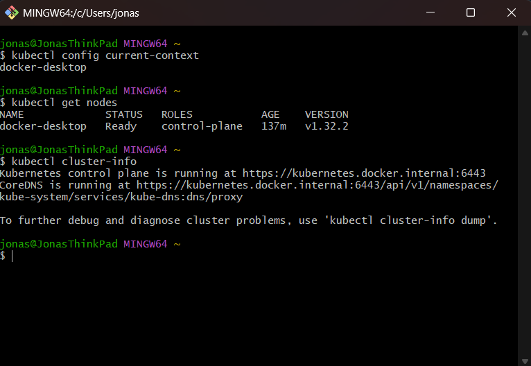

# Reflexion – Kubernetes Cluster Setup

## 1. Welche Methode hast du zum Aufsetzen deines lokalen Kubernetes Clusters gewählt (Docker Desktop, Minikube, Kind) und warum?

Ich habe mich für Docker Desktop entschieden, weil es schon auf meinem Rechner installiert war und den Einstieg sehr einfach macht. Man kann Kubernetes dort mit nur wenigen Klicks aktivieren, ohne dass man viel zusätzlich konfigurieren muss. Für meine Zwecke – also vor allem zum Ausprobieren und Lernen – hat das völlig ausgereicht.

## 2. Beschreibe in eigenen Worten, was die Control Plane eines Kubernetes Clusters ist und welche Kernrolle sie hat (ohne spezifische Komponenten wie etcd, Scheduler etc. im Detail zu nennen).

Die Control Plane ist im Prinzip die zentrale Steuerungseinheit des Clusters. Sie kümmert sich darum, dass alles läuft wie geplant – also z. B. dass die richtigen Anwendungen auf den richtigen Nodes laufen, dass neue Pods gestartet werden, wenn alte ausfallen, und dass der gewünschte Zustand immer wiederhergestellt wird, wenn sich was ändert.

## 3. Was ist die Rolle eines Worker Node in einem Kubernetes Cluster?

Die Worker Nodes sind die Maschinen, auf denen die eigentlichen Anwendungen laufen. Sie führen die Container aus und stellen die Rechenleistung zur Verfügung. Alles, was ich deploye – also zum Beispiel ein Webserver oder eine Datenbank – läuft letztlich auf einem dieser Worker Nodes.

## 4. Der Befehl kubectl ist das Kommandozeilen-Tool zur Interaktion mit Kubernetes. Mit welchem zentralen Bestandteil der Kubernetes Architektur spricht kubectl direkt, wenn du einen Befehl absetzt?

kubectl kommuniziert direkt mit der Control Plane, genauer gesagt mit dem API-Server. Darüber kann ich Befehle absetzen, zum Beispiel um Pods zu erstellen oder mir den Status anzeigen zu lassen.

## 5. Wie hast du praktisch überprüft, dass kubectl erfolgreich eine Verbindung zu deinem lokalen Cluster herstellen konnte? Welche Befehle hast du dafür genutzt, und was hast du als erfolgreiche Ausgabe erwartet?

Ich habe als Erstes `kubectl cluster-info` verwendet. Wenn da eine Adresse zum Kubernetes Master angezeigt wird, weiß ich, dass die Verbindung grundsätzlich klappt. Danach habe ich `kubectl get nodes` benutzt – da sollte dann mindestens ein Node (also in meinem Fall von Docker Desktop) angezeigt werden, und als Status „Ready“. Das war für mich das Zeichen, dass alles richtig verbunden ist.

## 6. Basierend auf dem Theorieteil: Erkläre kurz die Kernidee der deklarativen Philosophie von Kubernetes.

Kubernetes funktioniert nach dem Prinzip: „So soll es aussehen“ statt „Mach genau das“. Das heißt, ich beschreibe in einer YAML-Datei den gewünschten Zustand – z. B. dass ein bestimmter Pod mit drei Replikaten laufen soll – und Kubernetes kümmert sich dann automatisch darum, dass dieser Zustand auch wirklich erreicht und aufrechterhalten wird.

